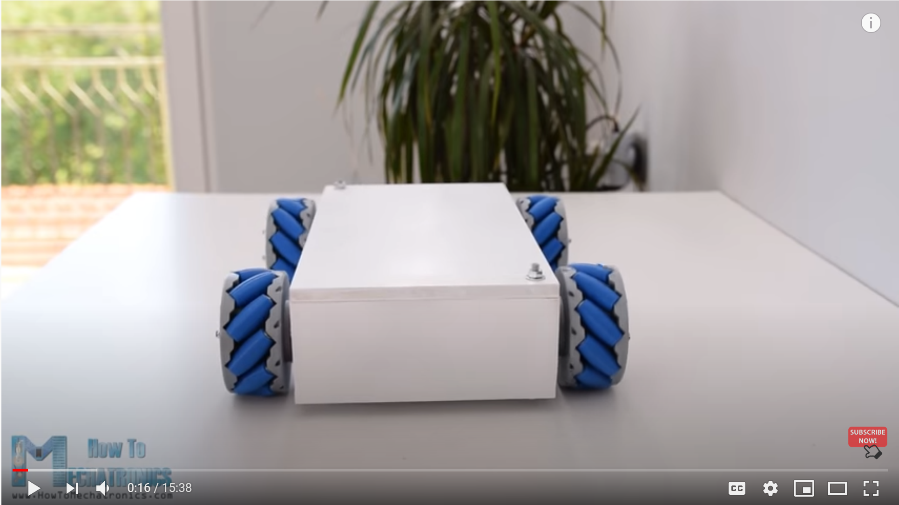
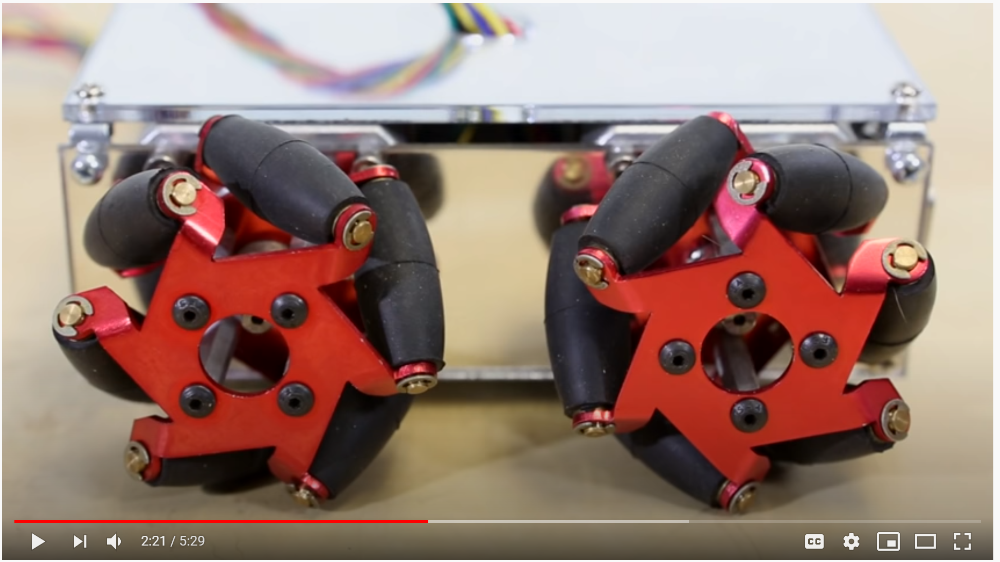
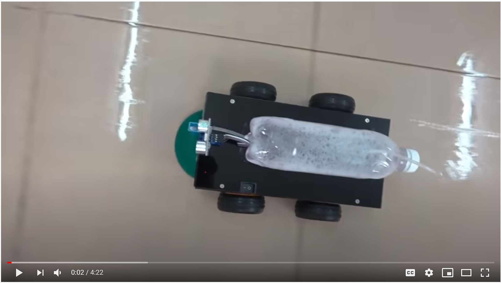
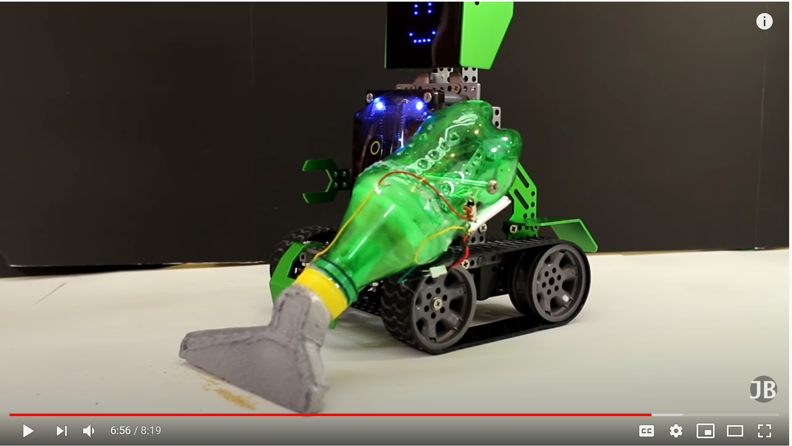
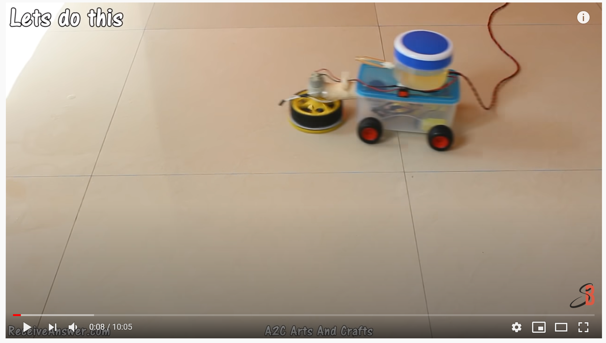
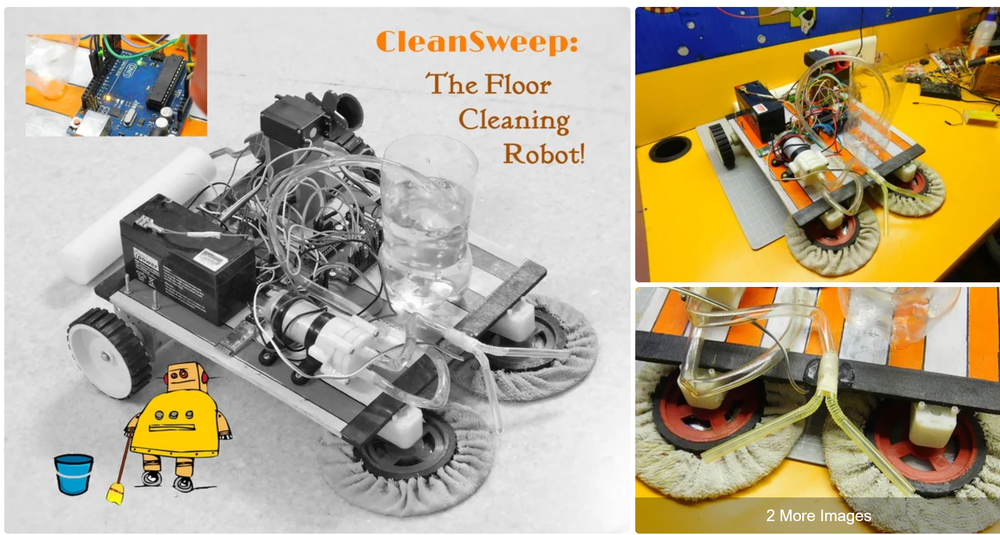
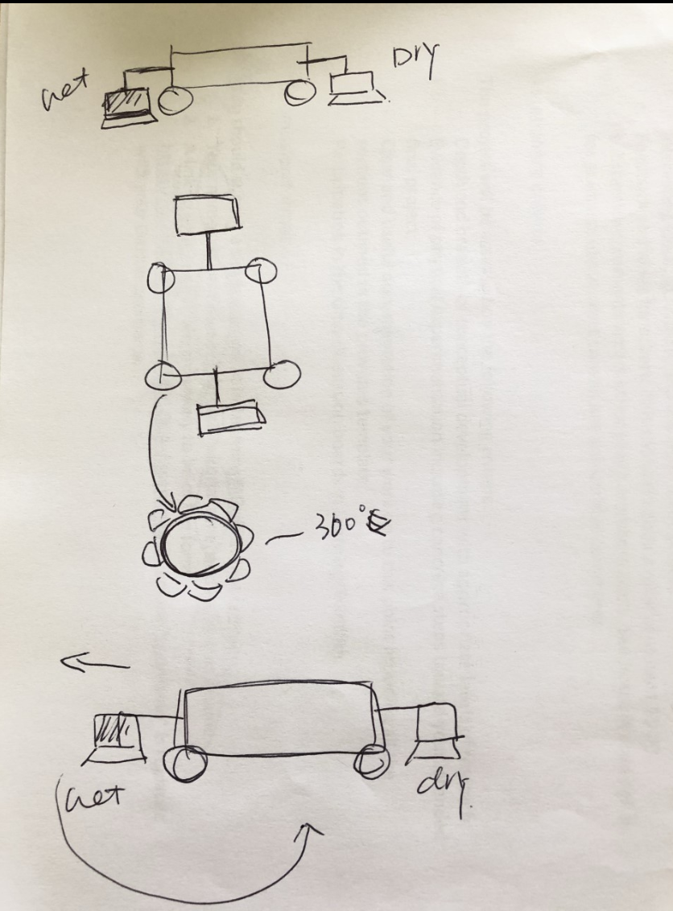
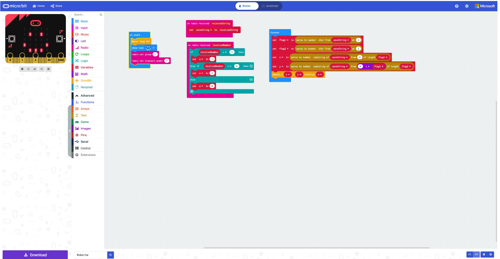
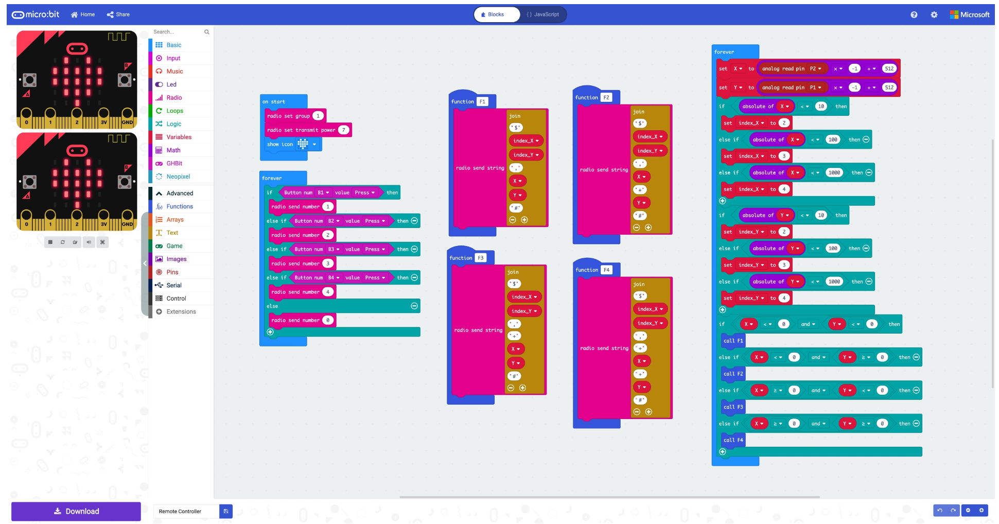

# 1701QCA Making Interaction - Assessment 2 workbook

You will use this workbook to keep track of your progress through the course and also as a process journal to document the making of your projects. The comments in italics throughout the template give suggestions about what to include. Feel free to delete those instructions when you have completed the sections.

When you have completed the template, submit the link to the GitHub Pages site for this repository as a link in Learning@Griffith. The link should be something like [https://qcainteractivemedia.github.io/1701QCA-Assessment2/](https://qcainteractivemedia.github.io/1701QCA-Assessment2/) where `qcainteractivemedia` is replaced with your GitHub username and `1701QCA-Assessment2` is replaced with whatever you called the repository this template is contained in when you set it up.

## Project working title ##
*Insert a name for the project as you conceive of it at the moment.*

## Related projects ##
*Find about 6 related projects to the project you choose. A project might be related through  function, technology, materials, fabrication, concept, or code. Don't forget to place an image of the related project in the appropriate folder and insert the filename in the appropriate places below. Copy the markdown block of code below for each project you are showing.*

### Related project 1 ###
*Arduino Mecanum Wheels Robot*

*https://www.youtube.com/watch?v=83tVkgT89dM*

This project is related to mine because *I think the wheels in this project can increase the fun of the robots in my project.*.

### Related project 2 ###
*SparkFun Mecanum Wheels*

*https://www.youtube.com/watch?v=O7FbDy-gE70*

This project is related to mine because *I did more research on wheels that can rotate 360 degrees to see if they can be used in my project.*.

### Related project 3 ###
*Remote Control Lawn Mower Robot*

*https://www.youtube.com/watch?v=Lb17YiUi43A*

This project is related to mine because *this is an interesting feature.*.

### Related project 4 ###
*An Automatic Floor Cleaning Robot*

*https://www.youtube.com/watch?v=0_-bF3OlHCI*

This project is related to mine because *as a housewife, I hope my robot can help me do more. This simple mopping robot provides me with a good direction.*.

### Related project 5 ###
*Vacuuming Robot*

*https://www.youtube.com/watch?v=R4Qe1n-1uWg*

This project is related to mine because *this homemade vacuum cleaner is very interesting. This gives my project more inspiration, and I can consider setting more functions for the robot.*.

### Related project 6 ###
*Floor Cleaning Machine*

*https://www.youtube.com/watch?v=_mMsg4ikuIA*

This project is related to mine because *the difference with the fourth project is that this is simpler and the materials are more daily. But the device in front of it is more complicated and provides me with a good reference.*.

## Other research ##
*Include here any other relevant research you have done. This might include identifying readings, tutorials, videos, technical documents, or other resources that have been helpful. For each particular source, add a comment or two about why it is relevant or what you have taken from it.*

### *CleanSweep: The Floor Cleaning Robot* ###

*https://www.youtube.com/watch?v=B92vy_2ewfg

In this project, the rotating mop at the front of the robot and the foam roller at the rear can complete the work well. There is also a water pump and water reservoir that can be opened when needed to sprinkle water on the floor and moisten the mop for proper cleaning. The foam roller is movable, which means that you can lift the foam roller when not in use. In addition, speed control is added to the drive motor in this robot. This project is still a bit complicated for me, but I am more clear about how my robot should be done.*

## Conceptual progress ##

### Design intent ###
*A floor cleaning robot with Mecanum Wheels*

### Design concept 1 ###
*Design concept 1:A board with a rag is installed in front of the robot. When the robot is moved by remote control, the rag will start to work and wipe the floor.* 

### Design concept 2 ###
*Design concept 2: When the robot is equipped with Mecanum Wheels, it can rotate 360, not just forward or backward.*

### Final design concept ###
*can install a dry rag or a foam shaft that can be rolled behind the robot to wipe off the water stains on the ground.*

### Interaction flowchart ###
*Draw a draft flowchart of what you anticipate the interaction process in your project to be. Make sure you think about all the stages of interaction step-by-step. Also make sure that you consider actions a user might take that aren't what you intend in an ideal use case. Insert an image of it below. It might just be a photo of a hand-drawn sketch, not a carefully drawn digital diagram. It just needs to be legible.*

## Physical experimentation documentation ##

*In this section, show your progress including whichever of the following are appropriate for your project at this point.
a.	Technical development. Could be code screenshots, pictures of electronics and hardware testing, video of tests. 
b.	Fabrication. Physical models, rough prototypes, sketches, diagrams of form, material considerations, mood boards, etc.
Ensure you include comments about the choices you've made along the way.*

*You will probably have a range of images and screenshots. Any test videos should be uploaded to YouTube or other publicly accessible site and a link provided here.*

Draft

Code Screenshots

Youtube Video

## Design process discussion ##
*Discuss your process in getting to this point, particularly with reference to aspects of the Double Diamond design methodology or other relevant design process.*

## Next steps ##
*Write a list or provide other information about your plan to move the project forward to be ready to present by video and documentation in week 12 of the course.*
